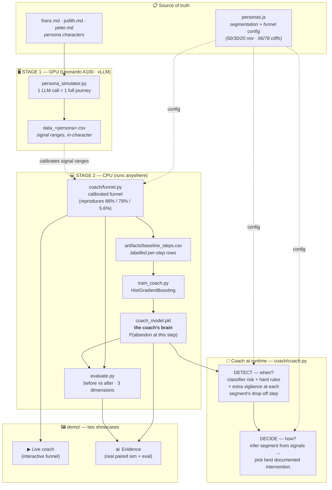
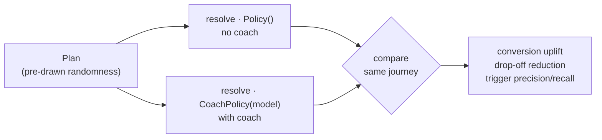
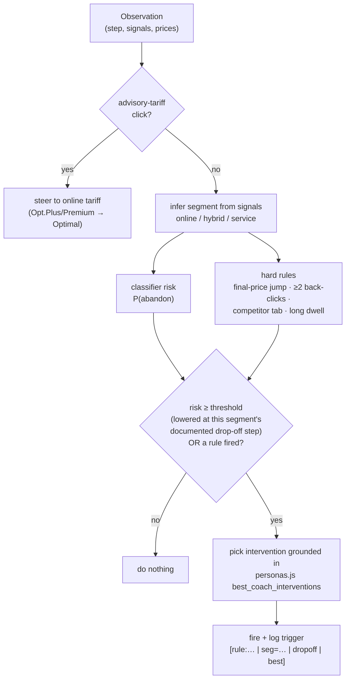
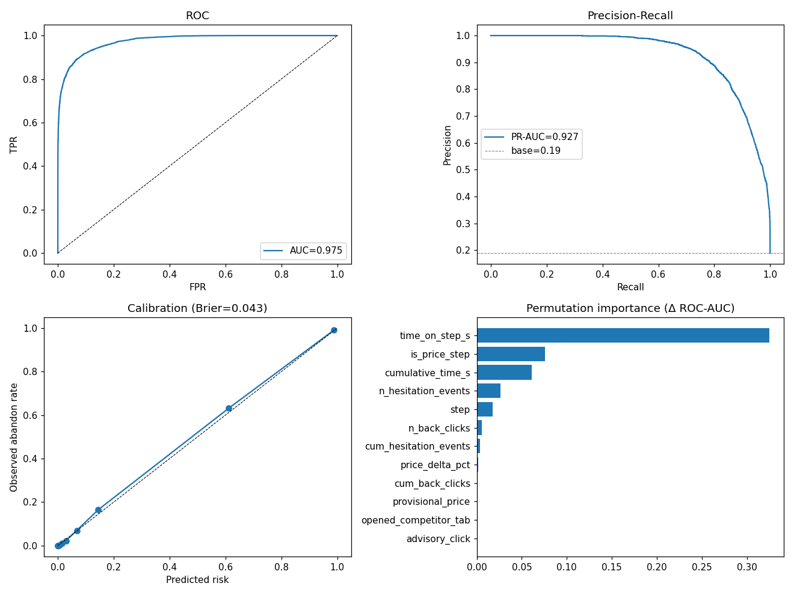
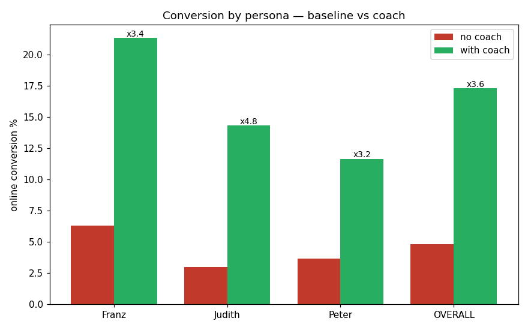
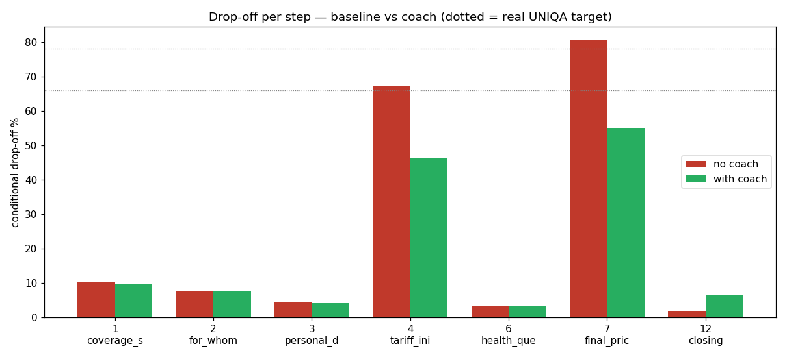
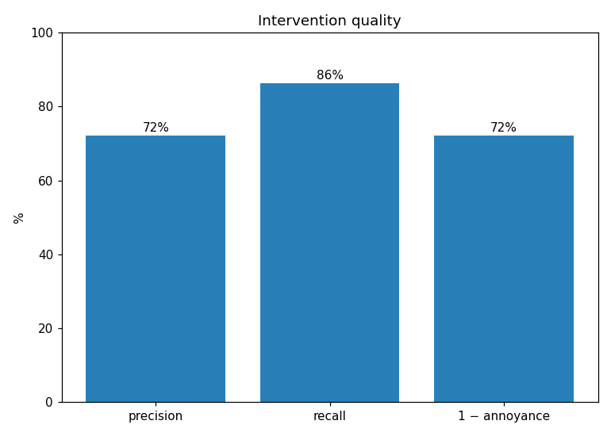

# UNIQA Conversion Coach — Zero One Hack_01 (Insurance / UNIQA track)

An AI **Conversion Coach** that detects when a visitor is about to abandon UNIQA's
online private-doctor health-insurance calculator and fires a **per-segment**
intervention to keep them converting online — instead of dropping off at the two
price cliffs (**66%** at the initial price, **78%** at the final price; **~5.6%**
baseline online conversion).

It is **not an LLM wrapper**. Detection is a trained gradient-boosting classifier
blended with transparent hard rules; the decision layer is per-segment logic
grounded in UNIQA's segmentation config. Every fire is logged with its trigger
reason, so the whole coach is auditable.

> **Headline:** on identical held-out journeys, online conversion goes from
> **~4.8% → ~17.3% (×3.6)**, with trigger precision **72%** / recall **86%**.
> Out-of-scope users (hospital / family / advisory-only tariffs) are cleanly
> routed to an advisor — a correct exit, never counted as a conversion.

---

## Repository layout

```
SubRepo/
├── leonardo_sim/     ← the implementation (funnel, coach, training, evaluation, personas)
│   ├── coach/        ← funnel + coach + features + response model (the graded engineering)
│   ├── artifacts/    ← trained model, eval metrics + plots, training data
│   ├── *.md          ← persona briefings + HOW_IT_WORKS
│   └── *.py / *.sh   ← simulator, trainer, evaluator, runners
├── demo/             ← FastAPI app, TWO showcases (live coach + evidence/eval)
├── LICENSE           ← MIT
├── README.md         ← you are here (architecture + technical doc)
└── REPORT.md         ← honest evaluation, assumptions, disclosures, scope handling
```

---

## How it works (architecture)

Two files are the single source of truth: edit a persona `.md` and the simulated
people change; edit `personas.js` and the coach's config changes. Nothing else
hard-codes persona facts.



### Why two stages?

1. **Stage 1 (GPU)** uses a real LLM to *act out* customer journeys in character
   (Franz bails at the final-price surprise, Judith at the initial price, Peter
   from early overwhelm), recording behavioural signals (dwell, hesitation,
   back-clicks, competitor-tab). This is the legitimate, honest use of the cluster
   and grounds the signal ranges.
2. **Stage 2 (CPU)** calibrates a probabilistic funnel to UNIQA's real numbers,
   emits labelled per-step rows, and trains a small classifier — **the coach's
   brain**. The coach blends that risk with transparent rules, infers the segment
   from behaviour, and fires the intervention `personas.js` documents as effective
   for that segment — never pushing an advisor on a segment that dislikes it.

---

## The calibrated funnel

A persona walks the 7 in-scope steps (`1,2,3,4,6,7,12`). Each step carries a
latent **friction** `f ∈ [0,1]`; the user leaves when `f` crosses the calibrated
hazard. The **same `f`** drives the observable signals — so high-friction users
both leave more *and* emit stronger signals, which is what makes the signals
genuinely predictive.

**Common random numbers (CRN).** A journey's randomness is drawn once into a
`Plan`, then resolved under different policies (no-coach baseline vs. coach).
Friction, signals, surcharge and coin-flips are shared, so baseline and coach
runs are perfectly paired — exactly what fair before/after measurement and clean
trigger precision/recall require.



Verify it reproduces the real funnel:

```bash
cd leonardo_sim && python -m coach.funnel --calibrate
# overall ≈ 5.2%  ·  step 4 ≈ 65%  ·  step 7 ≈ 79%  ·  step 5 = 0% (hospital, out of scope)
```

---

## The coach (detection → decision)



- **Detection (when).** The trained classifier outputs `P(abandon at this step)`;
  it is blended with transparent hard rules. The firing threshold is **lowered at
  the step where the inferred segment is documented to drop off** — vigilance
  where it matters.
- **Decision (how).** The coach infers a coarse segment from behaviour (no
  privileged knowledge of the true persona) and picks an intervention from that
  segment's documented best options. The user's response is resolved against the
  **true** persona by `response_model.py`, so a mis-inferred segment that triggers
  a backfiring nudge is penalised — which is what the intervention-quality metric
  captures (e.g. pushing an advisor on Franz *increases* his leave hazard).

### Classifier (the brain)

Trained on the funnel's labelled baseline rows (`artifacts/baseline_steps.csv`),
`HistGradientBoostingClassifier`, features in `coach/features.py` (no leakage —
only signals observable at the moment of the decision).



*ROC-AUC ≈ 0.975, PR-AUC ≈ 0.93, Brier ≈ 0.043. Most predictive features: time on
step, is-price-step, cumulative time.*

---

## Results (the three judged dimensions)

Held-out cohort (seed 99, disjoint from training), identical journeys baseline
vs. coach, re-weighted to the 50/30/20 traffic mix.

### Dimension 1 — conversion uplift + drop-off reduction




| | baseline | with coach | |
|---|---|---|---|
| **Overall online conversion** | ~4.8% | ~17.3% | **×3.6 (+12.5 pts)** |

The coach cuts the conditional drop-off at both price cliffs (step 4 ~67% → ~46%,
step 7 ~80% → ~55%) — the dotted lines are UNIQA's real targets the baseline
reproduces.

### Dimension 2 — works for all three segments

| segment (mix) | baseline | with coach | |
|---|---|---|---|
| Franz (50%) | 6.3% | 21.3% | ×3.4 |
| Judith (30%) | 3.0% | 14.3% | ×4.8 |
| Peter (20%) | 3.7% | 11.7% | ×3.2 |

The three personas drop at **different** steps (Franz final-price, Judith
initial-price, Peter early) and get **different** interventions — a single unified
nudge under-serves Peter and annoys Franz (quantified in REPORT.md).

### Dimension 3 — intervention quality



Trigger **precision 72%** (fired on a real would-leave), **recall 86%** (of
would-leave moments caught), **annoyance 28%** (fired when the user would have
stayed). It fires on real abandonment moments, not randomly.

---

## Technical reference

| Concern | Where | Notes |
|---|---|---|
| Product / funnel facts | `coach/config.py`, `personas.js` | tariffs, 50/30/20 mix, 66/78 cliffs, 5.6% baseline |
| Per-step hazards (calibrated) | `coach/config.py` `BASE_HAZARD` | shaped per archetype; verified by `--calibrate` |
| Behavioural signals | `coach/signals.py` | dwell / hesitation / back-clicks / competitor-tab from latent friction |
| Features (train == serve) | `coach/features.py` | single builder, no journey-outcome leakage |
| Detection thresholds | `coach/coach.py` `RISK_THRESHOLD`, `DROPOFF_VIGILANCE` | per-step; lowered at the segment's drop-off step |
| Response model (synthetic, documented) | `coach/response_model.py` | per-persona efficacy incl. backfires (Franz↔advisor, Peter↔more-info) |
| Scope routing | `coach/funnel.py` | hospital / "other persons" / Opt.Plus / Premium → advisor route = clean exit |

---

## Run it — one launcher, zero setup pain

`run.sh` at the repo root builds a local pip venv (no conda/pixi solve, so the
"No candidates for torch" / NFS-cache errors can't happen) and runs anything:

```bash
./run.sh app                              # web demo            → http://localhost:9696
./run.sh demo --compare judith --seed 17  # terminal side-by-side (advisor_routed → CONVERTED)
./run.sh demo --compare franz  --seed 10  # Franz: abandoned → CONVERTED
./run.sh demo --auto  --seed 42           # all three personas in the terminal
./run.sh eval --no-plots                  # the 3-dimension evaluation
./run.sh calibrate                        # verify baseline 5.6% / 66% / 78%
```

On an HPC login node it auto-runs `module load python`; elsewhere it uses any
Python ≥3.10 (override with `PYTHON=/path/to/python3`). It pins BLAS/OpenMP
threads so a login-node resource governor won't kill the run.

> Prefer to do it by hand? `cd demo && pip install -r requirements.txt && python app.py`.

The demo auto-finds `../leonardo_sim` (override with `LEONARDO_SIM=/path`). Two tabs:

1. **▶ Live coach** — click through the 7-step funnel; the coach reacts to
   behavioural signals. Every displayed number (prices, drop-off %, surcharge)
   comes from the engine, not hard-coded.
2. **📊 Evidence** — the **real engine**: a side-by-side baseline-vs-coach run on
   the *same* pre-drawn journey (shows which step the intervention flipped, with
   the trigger reason visible), plus the three evaluation dimensions live from
   `artifacts/eval_metrics.json`.

Optional Phi-3 chat: `pip install torch transformers` (otherwise the chat falls
back to instant doc-grounded replies; everything else is unaffected).

## Reproduce the analysis (CPU, ~1 min)

```bash
./run.sh calibrate            # verify the funnel reproduces 5.6% / 66% / 78%
./run.sh eval --no-plots      # the three before/after dimensions
./run.sh train                # retrain the coach classifier
```

For the full retrain-from-data pipeline use the implementation's own runner
(`cd leonardo_sim && ./run.sh pipeline`). Regenerate the LLM persona data on
Leonardo (GPU) with `bash leonardo_sim/run_all.sh` — see
`leonardo_sim/README_LEONARDO.md`.

---

## Honesty & reproducibility

- **Identical seeds** for baseline vs coach (common random numbers) — verified, not assumed.
- **Out-of-scope = correct exit:** advisor routes are reported separately and are
  never counted as online conversions.
- **Synthetic assumptions are documented** (response efficacies, surcharge
  scenarios) — see REPORT.md.
- **No secrets** in the repo or its git history. MIT licensed.

Full evaluation, the conversion-definition conflict, what is synthetic vs. real,
and demo disclosures are in **[REPORT.md](REPORT.md)**.
