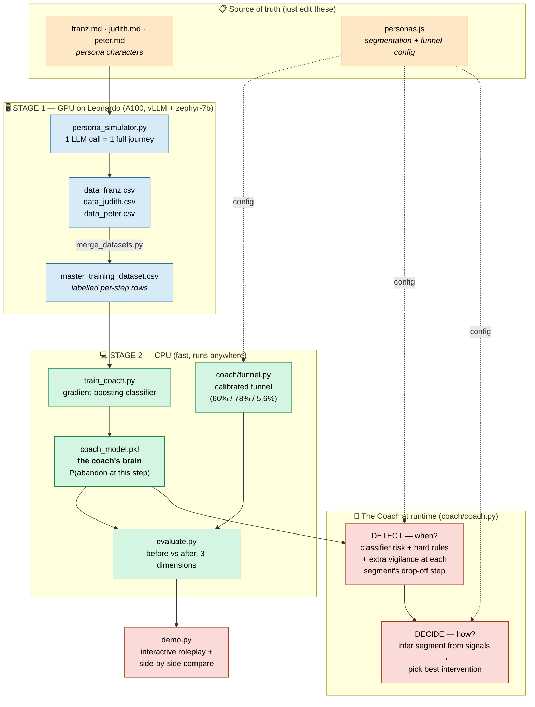

# UNIQA Conversion Coach — How It Works

A two-stage system that learns **when** and **how** to nudge a hesitating user
through UNIQA's online health-insurance funnel so more people convert online
instead of dropping off at the two price cliffs (66% at the initial price, 78%
at the final price; ~5.6% overall conversion today).

---

## The big picture



### Two files are the single source of truth

| File | Drives | Who reads it |
|---|---|---|
| `franz.md` / `judith.md` / `peter.md` | the **persona characters** the LLM role-plays | `persona_simulator.py` (Stage 1) |
| `personas.js` | the **segmentation + funnel facts** (traffic mix, drop-off steps, best interventions, taxonomy) | the **coach** (`config.py`, `coach/coach.py`) |

Edit a `.md` → the simulated people change. Edit `personas.js` → the coach's
config changes. No other file hard-codes persona facts.

---

## Why two stages?

1. **Stage 1 (GPU)** uses a real LLM to *act out* thousands of realistic
   customer journeys — each persona reacts in character (Franz bails at the
   final-price surprise, Judith at the initial price, Peter from early
   overwhelm) and we record the behavioural signals (dwell, hesitation,
   back-clicks, competitor-tab) plus a label: *did they abandon at this step?*
   This is the honest, legitimate use of the cluster.

2. **Stage 2 (CPU)** trains a small classifier on that data — **the coach's
   brain**: given the live signals at a step, what's the probability this user
   is about to leave? The coach blends that risk with transparent hard rules,
   infers the user's segment from behaviour, and fires the intervention that
   `personas.js` documents as effective for that segment — never pushing an
   advisor on a segment that dislikes it.

The coach decision is **auditable**: every fire logs its trigger
(`rule:… | seg=… | best`), so it's a transparent model + rules, not a black box.

---

## Quick start for teammates

Everything goes through `./run.sh` (auto-uses the right Python env).

```bash
# ── See it work right now (no GPU, uses the committed model) ───────────────
./run.sh demo --compare judith --seed 17     # side-by-side: routed → CONVERTED
./run.sh demo --compare peter  --seed 5      # Peter: proactive callback saves it
./run.sh demo --auto  --seed 42              # auto-run all three personas
./run.sh demo --persona franz                # YOU play Franz, step by step

# ── Re-run the analysis locally (CPU, ~1 min) ─────────────────────────────
./run.sh pipeline                            # baseline → train → evaluate → compare
./run.sh evaluate --no-plots                 # just the 3-dimension metrics

# ── Regenerate the training data on the GPU + retrain (fire and forget) ───
bash run_all.sh                              # 5000 journeys/persona (~1-2h), then
                                             # auto-merge + auto-train + auto-eval
N=1000 bash run_all.sh                       # quicker full run (~15 min)
squeue --me                                  # watch the jobs
```

### What each command produces

| Command | Output |
|---|---|
| `bash run_all.sh` | `master_training_dataset.csv` + `coach_model.pkl` + eval plots, automatically |
| `./run.sh train` | `artifacts/coach_model.pkl`, `classifier_eval.png`, `classifier_metrics.json` |
| `./run.sh evaluate` | `artifacts/eval_metrics.json`, `eval_dropoff.png`, `eval_conversion.png`, `eval_intervention_quality.png` |
| `./run.sh demo …` | live terminal trace of a journey with the coach's reasoning |

### To change the personas
- **Behaviour of a simulated customer** → edit `franz.md` / `judith.md` / `peter.md`, then `bash run_all.sh`.
- **What the coach knows / does** (drop-off steps, best interventions, traffic mix) → edit `personas.js` (no retrain needed for the rules; retrain only if you change the data).

---

## The headline result (latest eval)

Online conversion, 50/30/20 traffic mix, identical journeys with vs without the coach:

| | baseline | with coach |
|---|---|---|
| **Overall** | ~4.8% | ~17% (≈ ×3.5) |
| Franz | 6.3% | 21% |
| Judith | 3.0% | 14% |
| Peter | 3.7% | 12% |

Trigger precision ~72%, recall ~86% — it fires on real would-leave moments, not
randomly. (Numbers refresh every time you run `./run.sh evaluate`.)
